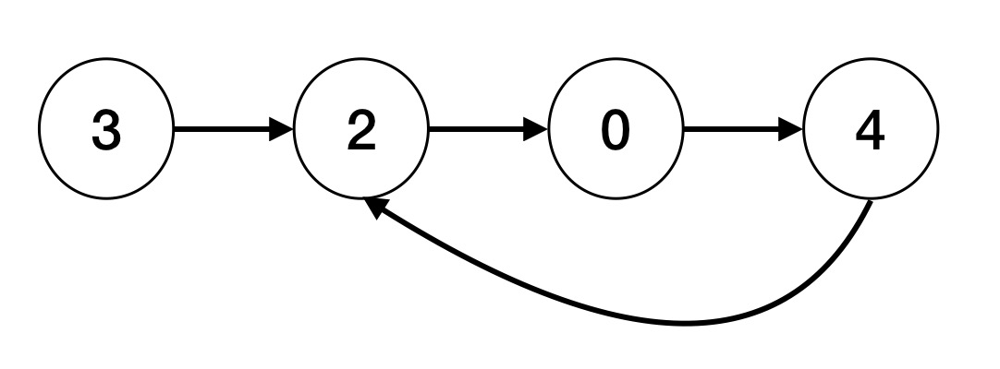
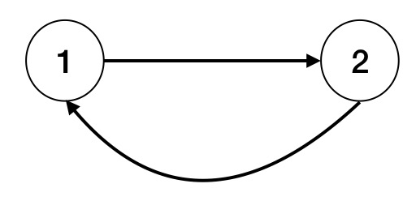
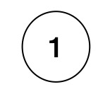

[返回首页](../../README.md)

# 链表

LeetCode 链接：
* 反转链表：https://leetcode.com/problems/reverse-linked-list/
* 两两交换链表中的节点：https://leetcode.com/problems/swap-nodes-in-pairs/
* 环形链表（一）：https://leetcode.com/problems/linked-list-cycle
* 环形链表（二）：https://leetcode.com/problems/linked-list-cycle-ii
* https://leetcode.com/problems/reverse-nodes-in-k-group

链表（Linked List）是一种常见的基础数据结构，是一种线性表，但是并不会按线性的顺序存储数据，而是在每一个节点里存到下一个节点的指针（Pointer）。

由于不必须按顺序存储，链表在插入的时候可以达到 O(1) 的复杂度，比另一种线性表——顺序表快得多，但是查找一个节点或者访问特定编号的节点则需要 O(n) 的时间，而顺序表相应的时间复杂度分别是 O(log n) 和 O(1)。

使用链表结构可以克服数组链表需要预先知道数据大小的缺点，链表结构可以充分利用计算机内存空间，实现灵活的内存动态管理。但是链表失去了数组随机读取的优点，同时链表由于增加了结点的指针域，空间开销比较大。

在计算机科学中，链表作为一种基础的数据结构可以用来生成其它类型的数据结构。链表通常由一连串节点组成，每个节点包含任意的实例数据（data fields）和一或两个用来指向上一个/或下一个节点的位置的链接（links）。链表最明显的好处就是，常规数组排列关联项目的方式可能不同于这些数据项目在记忆体或磁盘上顺序，数据的访问往往要在不同的排列顺序中转换。而链表是一种自我指示数据类型，因为它包含指向另一个相同类型的数据的指针（链接）。

链表允许插入和移除表上任意位置上的节点，但是不允许随机存取。链表有很多种不同的类型：单向链表，双向链表以及循环链表。

链表通常可以衍生出循环链表，静态链表，双链表等。对于链表使用，需要注意头结点的使用。

## 反转链表
题目：反转一个单链表

示例：

```
输入: 1->2->3->4->5->NULL
输出: 5->4->3->2->1->NULL
```

LeetCode：https://leetcode.com/problems/reverse-linked-list/

```
// 单向链表定义
function ListNode(val) {
    this.val = val;
    this.next = null;
}
// 反转链表
var reverseList = function(head) {
    let cur = head
    let pre = null
    while (cur) {
        let tmp = cur.next
        cur.next = pre
        pre = cur
        cur = tmp
    }
    return pre
}
```

## 交换链表相邻节点

LeetCode：https://leetcode.com/problems/swap-nodes-in-pairs/submissions/

题目：给定一个链表，两两交换其中相邻的节点，并返回交换后的链表。

你不能只是单纯的改变节点内部的值，而是需要实际的进行节点交换。

示例:

给定 1->2->3->4, 你应该返回 2->1->4->3.

```
var swapPairs = function(head) {
    let result = new ListNode(0)
    result.next = head
    let pre = result, cur = pre.next, next = cur.next
    
    while (cur && next) {
        let tmp = next.next

        pre.next = next
        next.next = cur
        cur.next = tmp
        
        if (!tmp) {
            break
        }
        pre = cur
        cur = tmp
        next = tmp.next
    }
    return result.next
}
```

## 判断链表是否有环

LeetCode：https://leetcode.com/problems/linked-list-cycle/

给定一个链表，判断链表中是否有环。

为了表示给定链表中的环，我们使用整数 pos 来表示链表尾连接到链表中的位置（索引从 0 开始）。 如果 pos 是 -1，则在该链表中没有环。


示例 1：

输入：head = [3,2,0,-4], pos = 1
输出：true
解释：链表中有一个环，其尾部连接到第二个节点。



示例 2：

输入：head = [1,2], pos = 0
输出：true
解释：链表中有一个环，其尾部连接到第一个节点。


示例 3：

输入：head = [1], pos = -1
输出：false
解释：链表中没有环。



```
// 方法一：新增一个 Array 存储每个节点，判断当前节点是否在 Array 中，时间复杂度 O(n)，空间复杂度 O(n)
var hasCycle = function(head) {
    var arr = []
    let tmp = head
    while (tmp) {
        if (arr.indexOf(tmp) === -1) {
            arr.push(tmp)
            tmp = tmp.next
        } else {
            return true
        }
    }
    return false
}

// 方法二：龟兔赛跑，快慢指针的方法，时间复杂度 O(n)
var hasCycle = function(head) {
    let fast = slow = head
    while (fast && slow && fast.next) {
        fast = fast.next.next
        slow = slow.next
        if (fast === slow) {
            return true
        }
    }
    return false
}
```

# 参考文献
* [LeetCode 链表](https://leetcode-cn.com/tag/linked-list/)