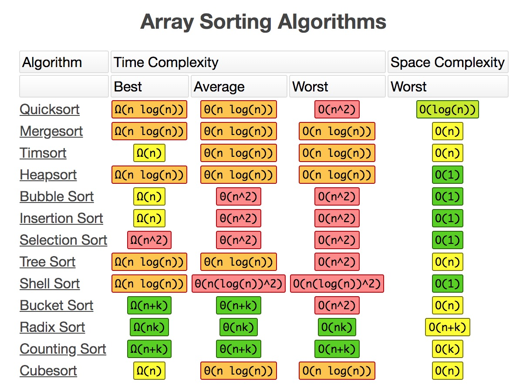

[返回首页](../../README.md)

# 排序算法

* <a href="#bubbleSort">冒泡排序法</a>
* <a href="#selectSort">选择排序法</a>
* <a href="#insertSort">插入排序法</a>
* <a href="#shellSort">希尔排序法</a>
* <a href="#shellSort">桶排序法</a> ！！！！！！
* <a href="#quickSort">快速排序法</a>

排序算法时间复杂度



## <a id="bubbleSort">冒泡排序法</a>

思路：比较相邻元素，前一个比后一个大，交换

复杂度：O(n^2)

```
function bubbleSort (arr) {
    if (!arr || arr.length <= 1) {
        return arr
    }
    let len = arr.length
    for (let i = 0; i < len - 1; i++) {
        for (let j = i + 1; j < len; j++) {
            if (arr[i] > arr[j]) {
                let tmp = arr[i]
                arr[i] = arr[j]
                arr[j] = tmp
            }
        }
    }
    return arr
}
```

## <a id="selectSort">选择排序法</a>

思路：在长度N的无序数组中，第一次遍历 N-1 个数，找到最小值与第一个元素进行交换。第二次遍历 N - 2 个数，找到最小值与第二个元素交换。

复杂度：时间复杂度 O(n^2)，空间复杂度 O(1)。

```
function selectSort (arr) {
    if (!arr || arr.length <= 1) {
        return arr
    }
    let len = arr.length
    for (let i = 0; i < len - 1; i++) {
        let minIdx = i
        for (let j = i + 1; j < len; j++) {
            if (arr[minIdx] > arr[j]) {
                minIdx = j
            }
        }
        if (minIdx !== i) {
            let tmp = arr[i]
            arr[i] = arr[minIdx]
            arr[minIdx] = tmp
        }
    }
    return arr
}
```

## <a id="insertSort">插入排序法</a>

思路：假定前 n -1 已经排好序，将第n个数插到前面的有序数列中，使得这n个数也是排好序的。

复杂度：时间复杂度 O(n^2)，空间复杂度 O(1)。

```
function insertSort (arr) {
    if (!arr || arr.length <= 1) {
        return arr
    }
    let len = arr.length
    for (let i = 1; i < len; i++) {
        if (arr[i] < arr[i - 1]) {
            let j = i - 1, t = arr[i]
            while (j >= 0 && arr[j] > t) {
                arr[j + 1] = arr[j]
                j--
            }
            arr[j + 1] = t
        }
    }
    return arr
}
```

## <a id="shellSort">希尔排序法</a>

思路：将整个序列分割成若干子序列分别进行直接插入，待整个序列中的记录基本有序时，再对整体记录依次直接插入排序。

复杂度：时间复杂度 O(n^2)，空间复杂度 O(1)。

## <a id="quickSort">桶排序排序法</a>

https://leetcode-cn.com/problems/contains-duplicate-iii/

## <a id="quickSort">快速排序法</a>

思路：在数组中选择一个数字，把数字分成两部分，比选择数字小的数字移到数组左边，比其大的数字移到右边。

复杂度：O(nlogn)

```
function partition (arr, start, end) {
    if (!arr || start < 0 || end >= arr.length || start > end) {
        return 
    }
    let pivot = arr[start]
    while (start < end) {
        while (start < end && arr[end] >= pivot) {
            end--
        }
        if (start < end) {
            arr[start] = arr[end]
        }
        while (start < end && arr[start] <= pivot) {
            start++
        }
        if (start < end) {
            arr[end] = arr[start]
            end--
        }
    }
    arr[start] = pivot
    return start
}

function quickSort (arr, x, y) {
    if (x < y) {
        let k = partition(arr, x, y)
        quickSort(arr, x, k - 1)
        quickSort(arr, k + 1, y)
    }
}

// 调用
let num = [9, 4, 7, 2, 5, 1]
quickSort(num, 0, num.length - 1)
```
