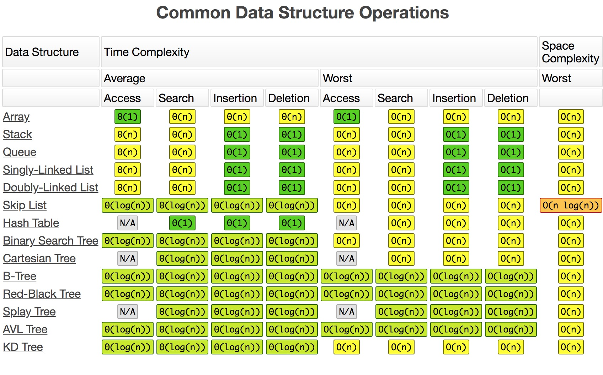

[返回首页](../../README.md)

# 简介

* 栈：FILO(First In Last Out, 先入后出)
* 队列：FIFO(First In First Out，先入先 出)

数据操作时间复杂度列表



# 题目

## 比较含退格的字符串

### 描述

给定 S 和 T 两个字符串，当它们分别被输入到空白的文本编辑器后，判断二者是否相等，并返回结果。 # 代表退格字符。

 

示例 1：

输入：S = "ab#c", T = "ad#c"
输出：true
解释：S 和 T 都会变成 “ac”。
示例 2：

输入：S = "ab##", T = "c#d#"
输出：true
解释：S 和 T 都会变成 “”。
示例 3：

输入：S = "a##c", T = "#a#c"
输出：true
解释：S 和 T 都会变成 “c”。
示例 4：

输入：S = "a#c", T = "b"
输出：false
解释：S 会变成 “c”，但 T 仍然是 “b”。
 

提示：

1 <= S.length <= 200
1 <= T.length <= 200
S 和 T 只含有小写字母以及字符 '#'。

来源：力扣（LeetCode）
链接：https://leetcode-cn.com/problems/backspace-string-compare


```
var backspaceCompare = function(S, T) {
    if (!S || !T) {
        return true
    }
    let newS = [], newT = [], lenS = S.length, lenT = T.length
    for (let i = 0; i < lenS; i++) {
        if (S[i] === '#') {
            newS.pop()
        } else {
            newS.push(S[i])
        }
    }
    for (let j = 0; j < lenT; j++) {
        if (T[j] === '#') {
            newT.pop()
        } else {
            newT.push(T[j])
        }
    }
    return newS.join('') === newT.join('')
}
```

# 参考文献

* [https://www.bigocheatsheet.com/](https://www.bigocheatsheet.com/)