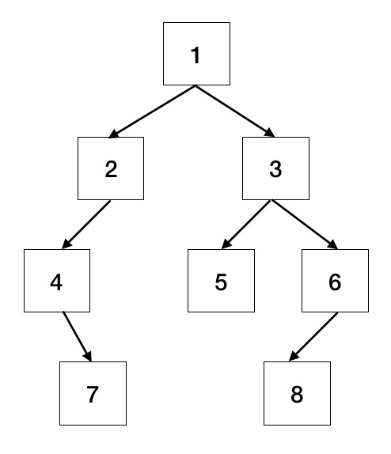

[返回首页](../../README.md)

# 重建二叉树

题目：输入某二叉树前序遍历和中序遍历的结果，请重建该二叉树。加入输入前序遍历 [1, 2, 4, 7, 3, 5, 6, 8] 和中序遍历 [4, 7, 2, 1, 5, 3, 8, 6]



LeetCode：https://leetcode-cn.com/problems/construct-binary-tree-from-preorder-and-inorder-traversal/

```
function TreeNode (val) {
    this.val = val
    this.left = null
    this.right = null
}

function constructor (preOrder, inOrder) {
    if (!preOrder || !inOrder || preOrder.length <= 0 || inOrder.length <= 0 || 
        preOrder.length !== inOrder.length) {
            return null
        }
    let root = new TreeNode(preOrder[0])
    let index = inOrder.indexOf(preOrder[0]), len = preOrder.length
    root.left = constructor(preOrder.slice(1, index + 1), inOrder.slice(0, index))
    root.right = constructor(preOrder.slice(index + 1), inOrder.slice(index + 1))
    return root
}
```