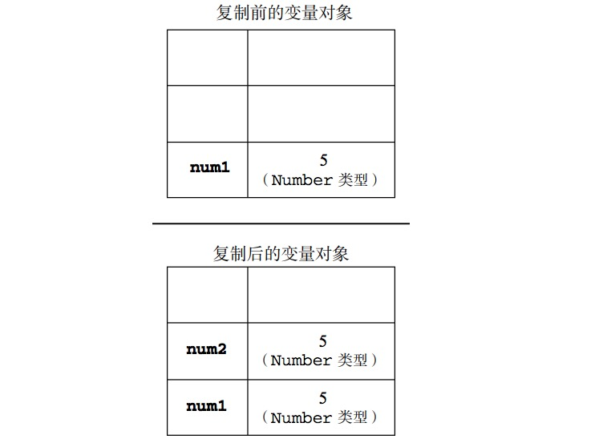
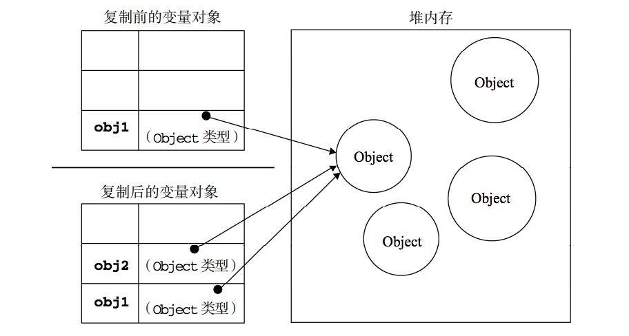

[返回首页](../../README.md)

# 深拷贝和浅拷贝

## 前言


> 栈(stack)：自动分配的内存空间，由系统自动释放。
> 堆(heap)：动态分配内存，大小不定，也不会自动释放。

#### 数据类型

我们知道 `JavaScript` 有两种数据类型：值类型和引用类型。

* 值类型（基本类型）：存放在栈内存中的简单数据段，数据大小确定。有六种基本类型：字符串（String）、数字(Number)、布尔(Boolean)、对空（Null）、未定义（Undefined）、Symbol（ES6 新增）。
* 引用数据类型：存放在堆内存中的对象，变量实际上保存的是一个指向内存地址的指针。主要有对象(Object)、数组(Array)、函数(Function) 等。

#### 值传递与引用传递

除了保存的方式不同之外，在从一个变量向另一个变量复制基本类型值和引用类型值时，也存在不
同。如果从一个变量向另一个变量复制基本类型的值，会在变量对象上创建一个新值，然后把该值复制
到为新变量分配的位置上。我们看看下面这个例子：

```
var num1 = 5
var num2 = num1

num2 = 3
console.log(num1)   // 5
```



在此，num1 中保存的值是 5。当使用 num1 的值来初始化 num2 时，num2 中也保存了值 5。但 num2
中的 5 与 num1 中的 5 是完全独立的，该值只是 num1 中 5 的一个副本。此后，这两个变量可以参与任何操作而不会相互影响。

当从一个变量向另一个变量复制引用类型的值时，同样也会将存储在变量对象中的值复制一份放到为新变量分配的空间中。不同的是，这个值的副本实际上是一个指针，而这个指针指向存储在堆中的一个对象。复制操作结束后，两个变量实际上将引用同一个对象。因此，改变其中一个变量，就会影响另一个变量，如下面的例子所示：

```
var obj1 = new Object()
var obj2 = obj1
obj1.name = 'hello'
console.log(obj2.name)  // hello
```

首先，变量 obj1 保存了一个对象的新实例。然后，这个值被复制到了 obj2 中；换句话说，obj1
和 obj2 都指向同一个对象。这样，当为 obj1 添加 name 属性后，可以通过 obj2 来访问这个属性，
因为这两个变量引用的都是同一个对象。图 4-2 展示了保存在变量对象中的变量和保存在堆中的对象之
间的这种关系。



## 深拷贝和浅拷贝

### 定义

> 浅拷贝：创建一个新对象，这个对象有着原始对象属性值的一份精确拷贝。如果属性是基本类型，拷贝的就是基本类型的值，如果属性是引用类型，拷贝的就是内存地址 ，所以如果其中一个对象改变了这个地址，就会影响到另一个对象。

> 深拷贝：将一个对象从内存中完整的拷贝一份出来,从堆内存中开辟一个新的区域存放新对象,且修改新对象不会影响原对象。

```
function deepClone (obj) {
    if (obj === null) {
        return obj
    }
    if (obj instanceof RegExp) return new RegExp(obj)
    if(obj instanceof Date) return new Date(obj)
    // 基础类型
    if (typeof obj !== 'object') {
        return obj
    }
    let t = new obj.constructor()
    for (let key in obj) {
        t[key] = deepClone(obj[key])
    }
    return t
}
```


# 参考文献
* [如何写出一个惊艳面试官的深拷贝?](https://juejin.im/post/5d6aa4f96fb9a06b112ad5b1)
* JavaScript高级程序设计
* [【面试篇】寒冬求职季之你必须要懂的原生JS(上) - 什么是深拷贝？深拷贝和浅拷贝有什么区别](https://juejin.im/post/5cab0c45f265da2513734390#heading-21)