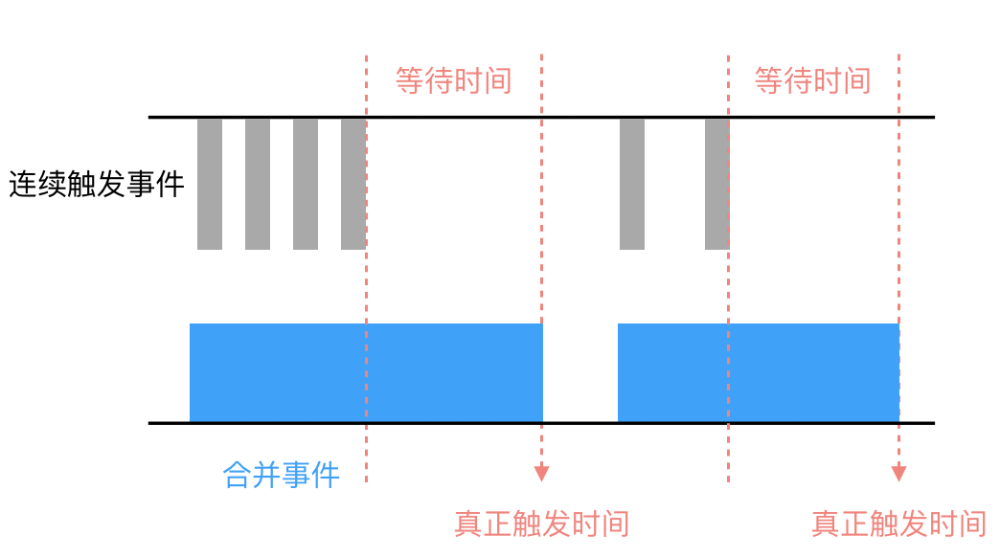
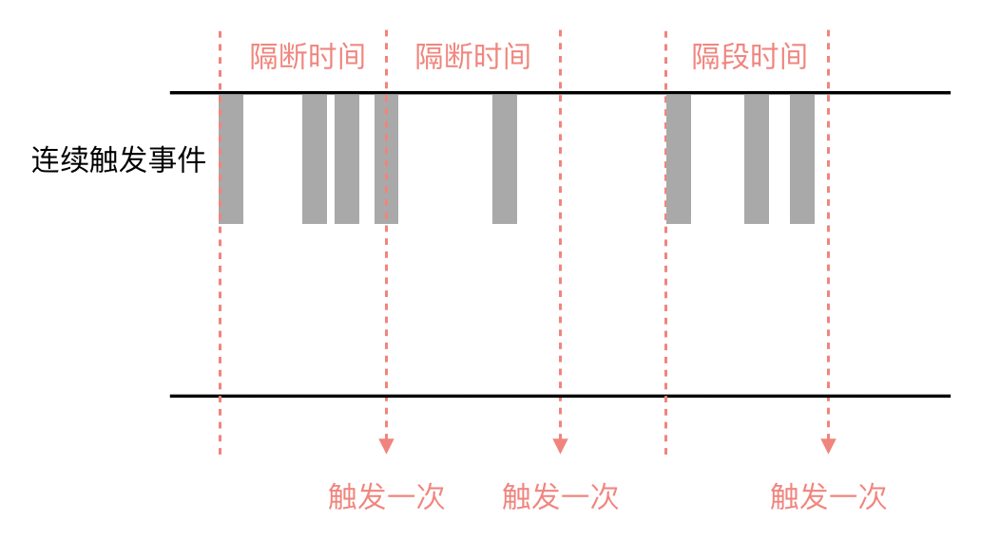

[返回首页](../../README.md)

# 防抖与节流

## 什么是函数防抖与节流

如果绑定事件中有窗口 resize 和 scroll、输入框内容校验等时，经常会出现事件频发触发的场景，导致事件回调函数被频繁调用，影响页面性能，给浏览器造成负担。此时，采用防抖和节流的方式来减少回调函数被调用的频率，提升页面性能，同事又不影响实际效果。

> 防抖（debounce）：任务频繁触发的情况下，只有任务触发时间间隔超过指定的间隔的时候，任务才会被执行。

> 节流（throttle）：任务频繁触发时，在指定时间间隔内任务只会被执行一次。


## 防抖（debounce）

以用户注册验证用户名是否可用，很多网站为了提高用户体验，会在用户输入的时候就去判断这个用户名是否可用，而不用等到输入框失去焦点再去做判定。



简易的防抖函数：

```
function debounce (callback, delay) {
    let timeout = null
    let debounced = function () {
        let me = this
        let args = arguments
        if (timeout !== null) {
            clearTimeout(timeout)
        }
        timeout = setTimeout(function () {
            timeout = null
            callback.apply(me, args)
        }, delay)
    }

    return debounced
}

// 调用
function handle () {
    // 业务处理逻辑
}
inputDOM.addEventListener('input', debounce(handle, 300))
```

函数防抖原理很简单，利用闭包维护一个定时器`timeout`，在规定时间`delay`后触发函数，如果在`delay`时间间隔内再次触发，就会调用`clearTimeout`，清除定时器，`timeout`会在保存一个新的定时器。

## 节流（throttle）

通常判断是否滚动到底部，以此按分页来加载资源数据，通常监听`scroll`事件，然后回调函数中判断是否滚到底部的逻辑。这样会影响页面性能，当滚动时，浏览器会一直计算判断是否滚到底部的逻辑。真实场景中是不需要这么做的：可以在滚动过程中每隔一段时间去计算这个逻辑。而函数节流就是每隔一段时间去执行一次。



```
function throttle (callback, delay) {
    let timer = null
    return function () {
        let me = this
        let args = arguments
        if (!timer) {
            setTimeout(() => {
                callback.apply(me, args)
                timer = null
            })
        }
    }
}

function handle () {
    // 业务处理逻辑
}

window.addEventListener('scroll', throttle(handle, 1000))
```

# 总结

防抖和节流的区别：函数节流不管时间触发多频繁，在指定时间一定会执行一次事件处理函数；防抖会在事件触发时间间隔超过指定时间时才会执行一次事件处理函数。

使用防抖与节流可以节约计算机资源，合理利用他们会提升网页性能。

# 参考文献

* [js的防抖与节流](https://mp.weixin.qq.com/s/Vkshf-nEDwo2ODUJhxgzVA)
* [防抖和节流原理分析](https://juejin.im/post/5b7b88d46fb9a019e9767405)
* [函数节流与函数防抖](https://juejin.im/entry/58c0379e44d9040068dc952f)